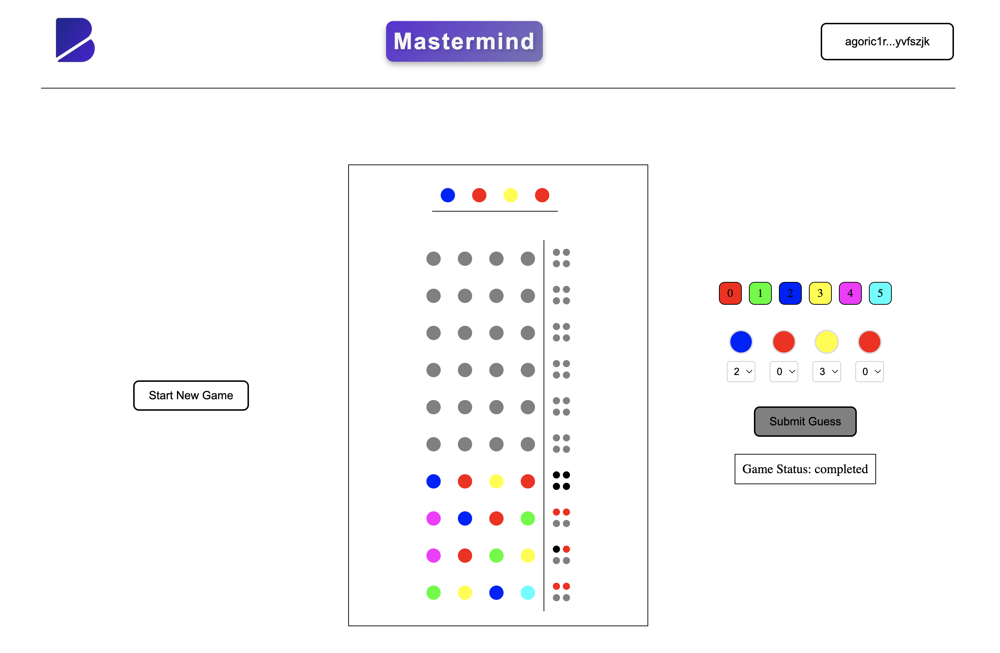

# Mastermind Game

## Overview

Welcome to the Mastermind Game project!  

The purpose of this project is to showcase a simple dApp I have built to explore the gaming use case on [Agoric](https://agoric.com/) blockchain. I also want to improve my frontend skills by building a User Interface to connect a wallet, query the smart contract state, and build and sign transactions.

This dApp implements a version of the Mastermind game. The contract acts as the code maker, generating a sequence of four colored pegs from a set of six available colors. The sequence (secret code) is kept hidden from the user until the contract wins or loses the game.
The user, code breaker, is allowed to guess four colored pegs in a specific order and will receive feedback in return.  
The game is finished when the codebreaker guesses the exact sequence, or if it cannot guess the code within the given 10 attempts.


## Key Features

- **Connect Wallet**: Seamlessly connect your Keplr wallet to interact with the dApp;
- **Create New Game**: Start new games with a new secret code each;
- **Guess The Code**: Submit guesses to crack the code;
- **Feedback Mechanism**: For each guess, the game provides a feedback to aid your progress:
  - **Black Color**: Represents correct color in the correct position.
  - **Red Color**: Represents correct color in the wrong position.
- **Game Phases**: Easily track the current phase of your game:
  - **Active**: The game is ongoing, and you can continue guessing.
  - **Completed**: You’ve successfully guessed the correct code and won the game.
  - **Failed**: You’ve run out of attempts without guessing the code, resulting in a loss.


--- 





## Secret Code

The secret code of each new game is generated via the [Mersenne-Twister](https://www.npmjs.com/package/mersenne-twister) package, which is a pseudorandom number generator.

At the [generateSecretCode](https://github.com/Jorge-Lopes/mastermind/blob/main/contract/src/utils.js#L4-L13) function, every time a new game is initiated, a new instance of the Mersenne Twister `generator` is created and used to append 4 digits into an array, using the random method to produce a number between 0 and 5.

To create the Mersenne Twister generator, we need to pass an integer (seed) into the constructor, which will always produce the same random sequence.
In this implementation, the seed being used is the absValue returned by the `getCurrentTimestamp` method of the `chainTimerService`, at the moment the `makeGameHandle` is executed.

**IMPORTANT**:

- The seed is used to initialize the random number generator can be extracted from the chain logs, making the random number sequence predictable for anyone running a node.
- The secret code is currently being written to `vstorage` at the moment a game is initiated, to make it easier to test it. This should be updated to expose its value only if the game phase is not "active".

## Getting Started

Detailed instructions on setting up the environment, are available at the [Agoric Documentation](https://docs.agoric.com/guides/getting-started/#installing-prerequisites) tutorial.  
If you already have the environment set up (i.e., the correct versions of Node.js, Yarn, and Docker), follow these steps:

1. **Clone the Repository**:

   ```bash
   git clone https://github.com/Jorge-Lopes/mastermind.git
   cd mastermind
   ```

2. **Install Dependencies**:

   ```bash
   yarn install
   ```

   _Downloading all the required dependencies may take several minutes. The UI depends on the React framework, and the contract depends on the Agoric framework. The packages in this project also include development dependencies for testing, code formatting, and static analysis._

3. **Start Local Agoric Blockchain**:

   ```bash
   cd contract
   yarn start:docker
   ```

4. **Check Logs**:

   ```bash
   cd contract
   yarn docker:logs
   ```

   Wait until you see entries like `... block 1003 begin` on the chain logs before proceeding to the next step.

5. **Start the Smart Contract**:

   ```bash
   cd contract
   yarn start:contract
   ```

6. **Start the UI**:

   ```bash
   cd ui
   yarn dev
   ```

   Use the link provided in the output to load the smart contract UI in your browser.

7. **Connect the Wallet**:

   - Follow this [guide](https://docs.agoric.com/guides/getting-started/#setting-up-a-keplr-wallet-demo-account) to set up a Keplr Wallet for this demo.  
   - After completing the steps above, click on `Connect Wallet` at the Mastermind UI.

8. **Play the Game**:

   - Start the game by pressing the `Start New Game` button;  
   - Use the `dropdown menu` to select the colors and sequence you wish to submit and press `submit Guess`;  
   - Approve the transaction on the `Keplr` extension;
   - The board will update with the guess submitted and the respective feedback.
   


## Testing

To run the unit tests:

```bash
cd contract
yarn test
```

## Future Improvements

- Expose a method to change the structure of the secretCode via the contract `creatorFacet`;
- Take advantage of the Agoric [Orchestration](https://docs.agoric.com/guides/orchestration/) package to interact with some Cosmos chains that provide reliable randomness, for example [Nois](https://nois.network/).

## Contributing

Feel free to submit issues or pull requests.  
Contributions are welcome to improve the game or extend its features.

---

Thank you for exploring this repo and have fun playing Mastermind!
